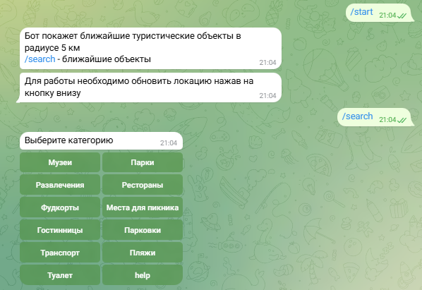
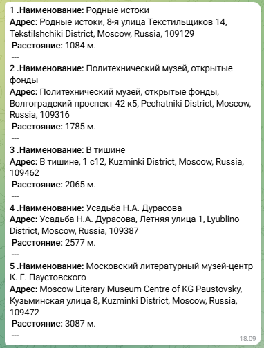
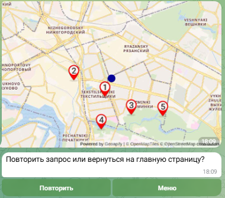

## @MyGeoBot

### Описание

Бот показывает несколько ближайших объектов выбранной категории на статичной карте с их кратким описанием

Бот построен на основе сервиса Geoapify Map APIs

### Краткая инструкция

После команды /start, бот предложит обновить локацию

Если локация не обновлена, бот за локацию примет "нулевую точку" в Москве

После обновления локации, или по команде /search будет предложено выбрать категорию для поиска объектов



Результат 





### Запуск бота

1. Для запуска бота нужно получить APIKEY на сайте https://www.geoapify.com/

2. git clone https://github.com/IlyaBril/TelegramBotGeo.git

3. Создать файл .env c содержанием

TG_API = Telegramm API Key

GEO_SITE_API = Geoapify API Key

4. Выполнить команду python main.py в корневой папке проекта

5. Для сборки и запуска контейнера с именем bot выполнить:

```sh
    $ docker build -t bot
    $ docker run -d --name bot  --restart always bot
    ```
